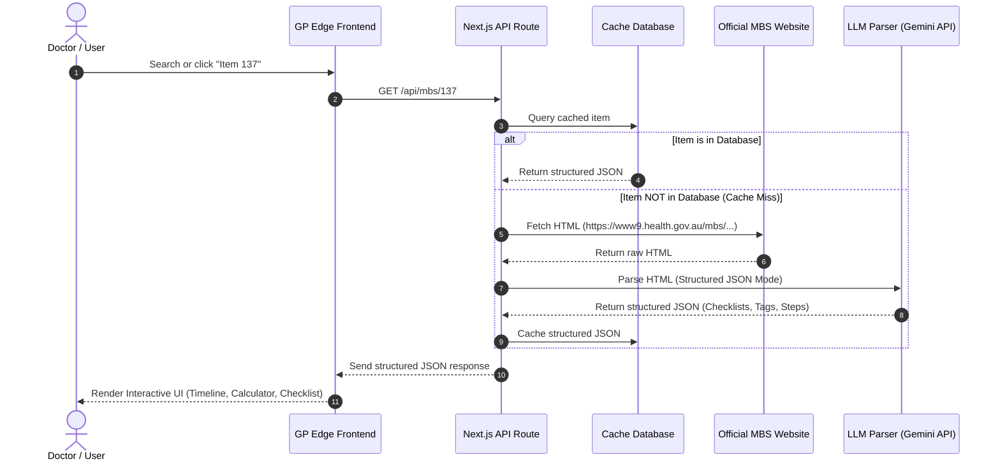

# Proposal: Intelligent MBS Billing Feature for GP Edge

## 1. The Core Problem
The Australian Government's Medicare Benefits Schedule (MBS) website is a critical tool for medical practitioners, but it suffers from severe user experience and technical limitations:
* **Walls of Text:** Important clinical rules, billing limits, and referral pathways are buried inside massive, unformatted text blocks (e.g., Explanatory Note `AN.0.25`).
* **Complex Multi-Step Pathways:** Items like **Item 137** require multi-step patient journeys (GP Referral → Specialist Assessment → Allied Health Assessment → Management Plan Formulation → Allied Health Treatment). Doctors must manually piece this journey together.
* **Rigid Exact-Match Search:** The official search engine is keyword-rigid. Searching for a colloquial clinical term like *"broken arm"* or *"autism assessment"* often yields zero results because the official database uses legalistic/technical terminology (*"fracture of the radius"*, *"complex neurodevelopmental disorder"*).
* **Audit and Compliance Risks:** Doctors face high anxiety around billing audits. The official site does not provide clean, interactive checklists to confirm compliance before submitting claims.

---

## 2. Comparison of Technical Strategies

To build this feature, two primary architectural pathways were analyzed:

```
┌─────────────────────────────────────────────────────────────────────────┐
│                           STRATEGY COMPARISON                           │
├─────────────────────────────────────┬───────────────────────────────────┤
│  Strategy 1: Static XML Ingestion   │ Strategy 2: Scrape + LLM + Cache  │
├─────────────────────────────────────┼───────────────────────────────────┤
│ • Hard to structure prose notes     │ • Automated formatting of notes   │
│ • Requires manual database upkeep   │ • Generates smart search tags     │
│ • No semantic search synonyms       │ • Semantic/colloquial search      │
│ • High developer maintenance        │ • Low maintenance, scales self    │
└─────────────────────────────────────┴───────────────────────────────────┘
```

### Strategy 1: Manually Parsing & Ingesting Government XML Dumps
In this approach, we download the official MBS XML database release (updated 3-4 times a year) and import it into our database.

* **Why it fails for our goals:**
  1. **Unformatted Explanatory Notes:** The XML dump only contains raw text blocks for explanatory notes. It does not parse them into checklists, steps, or pathways. We would have to manually code the logic for all 5,000+ items.
  2. **High Developer Upkeep:** Every time the government updates the schedule, our team must run complex ingestion scripts, handle schema changes, and manually rewrite custom pathway logic.
  3. **No Smart Search:** It does not solve the keyword matching problem unless we manually attach hundreds of search tags to each database row.

### Strategy 2 (Recommended): Dynamic Web Scraping + LLM Parsing & Caching
In this approach, when a user requests/searches for an MBS item (e.g., Item 137), the system performs a dynamic check:

1. **Cache Lookup:** Check if the structured item exists in the local database.
2. **On-Demand Scrape:** If not cached, fetch the raw HTML directly from the official MBS URL.
3. **LLM Extraction:** Pass the raw HTML to an LLM (such as Gemini/GPT) using a highly structured JSON Schema to extract:
   * **Plain-English Translation:** A simplified explanation of the item.
   * **Interactive Compliance Checklist:** A list of rules the doctor must tick off to bill safely.
   * **Synonyms & Search Tags:** Expanding colloquial search phrases (e.g., matching "autism" to Item 137).
   * **Visual Pathway Steps:** Sequence of referrals and treatments.
4. **Local DB Cache:** Save this structured JSON to our database so future queries for this item are instant.

* **Why this is better:**
  * **Zero Manual Effort:** The LLM does 100% of the extraction work. We write the parser once, and it works for all 5,000+ items.
  * **Intelligent Synonyms:** Automatically translates doctor-friendly search queries to official codes.
  * **Future-Proof:** If the government updates an item, we can simply invalidate the database cache for that item, and the system will automatically re-scrape and re-parse the updated rules.

---

## 3. Dynamic Pipeline Architecture



---

## 4. Development Strategy

We will implement this pipeline in four distinct phases:

### Phase 1: Database Model Design (Prisma)
Create the database tables to cache the structured MBS details:
* `MBSItem`: Holds core attributes (ID, title, category, group, fees, and plain-English description).
* `MBSPathwayStep`: Holds structured steps for complex care items.
* `MBSChecklistItem`: Holds audit and compliance criteria.
* `MBSSearchTag`: Links colloquial keywords to items.

### Phase 2: Scraping & LLM Ingestion API (`/api/mbs/[id]`)
* Build the scraper utility using `fetch` to extract raw HTML from the government site.
* Define a strong TypeScript schema for the expected JSON response.
* Configure the LLM Prompt with a strict JSON format structure, forcing it to generate:
  1. Plain-English summary.
  2. Compliance checklist.
  3. Context-relevant clinical case scenarios.
  4. Search synonyms.

### Phase 3: Smart Search & Synonym Matching
* Implement a search API endpoint that searches both the official titles and the LLM-generated search tags database.
* (Optional expansion) Set up vector embeddings to support semantic search.

### Phase 4: High-End Interactive UI
* **Header Stats Grid:** Displays Fee, 75%/85% Rebate, and Out-of-pocket Gap calculated dynamically based on practice fees.
* **Interactive Care Timeline:** Visual stepper highlighting limits (e.g. 8 assessment services lifetime, 20 treatment services).
* **Audit-Safe Checklist:** Clean, checklist cards for clinical compliance.
* **Tabbed Notes Section:** Tabbed interface separating Explanatory Notes, Case Scenarios, and Billing Rules.
